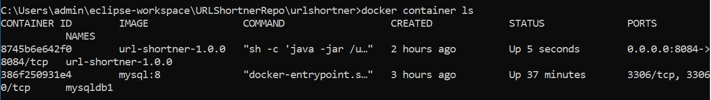
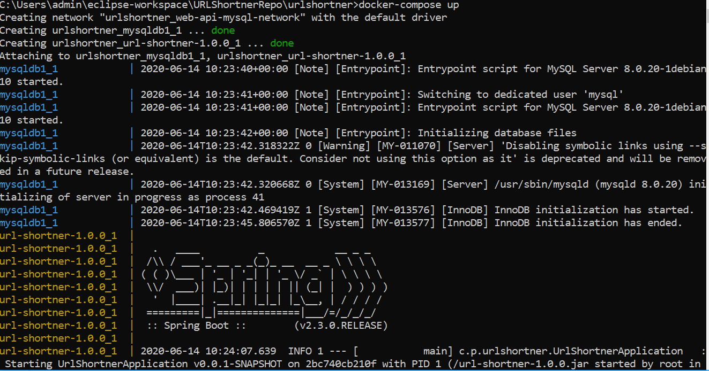
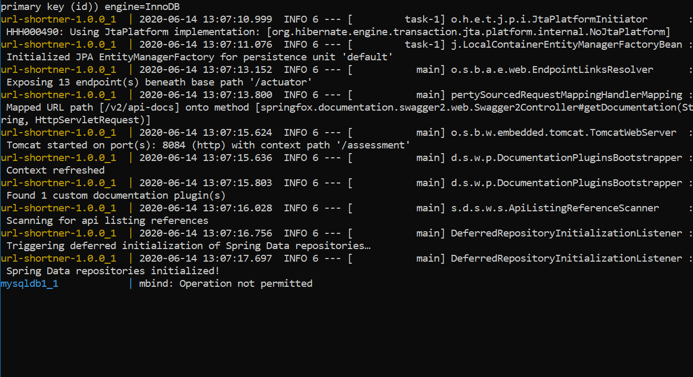

# URLShortnerRepo
An API for to create short URLs with Spring Boot, forwarding of short URLs to the original longer ones, having persistent storage in MySQL. The application is distributed in two docker image containers one for the jar file and one for MySQL .

## Table of Contents

* [About the Project](#about-the-project)
   * [Built With](#built-with)
* [Getting Started](#getting-started)
   * [Installation](#installation)
* [Usage](#usage)
* [Docker](#docker)
   * [Docker Usage](#docker-usage)
* [Contact](#contact)
* [Current Challenge](#challenge)
* [References](#References)

<!-- ABOUT THE PROJECT -->
## About The Project
*Most of us are familiar with seeing URLs like bit.ly or t.co on our Twitter or Facebook feeds. These are examples of shortened URLs, which are a short alias or pointer to a longer page link. This project demonstartes similar behaviour having sent the longer URL will be converted to shorter URL, further redirecting it to the url when short URL is been clicked.* 

### Built With
Below are the tools and languages used for this project.
* Spring Boot(2.3.0)
* Java(1.8) 
* Maven(3.6.1)
* MySQL Server(8.0)
* MySQL Workbench(8.0)
* JPA(2.1)
* Hibernate(5.1.0)
* Docker(19.03.1)
* Docker Compose(19.03.1)
* Swagger(2.9.2)
* Eclipse(4.13.0)

## Getting Started

The above tools project was built with can help running the project when clonned. Dependancy for the above mentioned tools and languages need to be added in the Maven pom.xml file.

### Installation
 
1. Clone the repo
git clone https://github.com/suprithashetty9/URLShortnerRepo.git or  download the zip directly.

2. Download MySQL server and MySQL workbench, run the script file called MySQLScriptFile.sql in the repository.This will help creating the database and table with columns required.

3. Add the project in an IDE of your choice, In Eclipse you can follow the steps below 
File > Import > Select Existing Maven Projects > mention the root directory till urlShortner inside which pom.xml is present > Finish

4. In the application.properties file change the server port which is free, specify the datasource properties provided by you while creating the schema.

5. Run as maven build providing Goals in the pop that appears as clean package,further run the project from UrlShortnerApplication class file.

## Usage
The easiest way to use the application it's through [Swagger UI]  using URL: [link](http://localhost:8084/assessment/swagger-ui.html)

* **REST API** 

* (**POST**) : `*/urlShortner*` --> Creates a short url for the given long URL
 
* (**GET**) : `*/urlShortner/{shortURLValue}*` --> Displays the orginal URL when passes the short url to {shortURLValue}

* (**GET**) - `*/urlShortner/urlStatistics/{value}*` --> Fetches the statistics for Short URL when passes the short url to {value}

Can also be accessed through Postman and CURL
Request URL:
~~~~
http://localhost:8084/assessment/urlShortner
~~~~

CURL:
~~~~
curl -X POST "http://localhost:8084/assessment/urlShortner" -H "accept: */*" -H "Content-Type: application/json" -d "{ \"url\": \"https://unitedforwildlife.org/10-amazing-elephant-facts-need-know/"}"
~~~~

Response :
~~~~
HTTP Status: 200
{"shortenedURL":"http://localhost:8084/assessment/urlShortner/9d26af0a"}
~~~~

~~~~
HTTP Status: 400
{Invalid URL}
~~~~

## Docker

Install Docker Desktop for Windows Pro, Enterprise version. For Windows Home version you can enable the WSL 2. For versions lower than that download Docker start terminal. 
You can check version using below command in your terminal or command prompt.
`docker --version`

### Docker Usage

This project needs two docker containers to be created which will be communicating with each other. Communication will happen over the network. One container for MySQL and the other one for Jar file.

Step 1 : Create a network named web-api-mysql-network as mentioned in yml file.
~~~~
docker network create web-api-mysql-network
~~~~ 

Step 2: Uncomment the line with mysqldb1 in line 20 and comment the line with localhost:3306 mentioned in application.properties file this will help to run on the container

Step 3: Build a container for MySQL using the image provided by dockerhub mysql:8, name the container it as mysqldb1 as provided in properties file and yml file of the web app, use the network created before, mention the user name and password as in the properties file.
~~~~
docker container run --name mysqldb1 --web-api-mysql-network -e MYSQL_ROOT_PASSWORD=root -e MYSQL_DATABASE=url_directory -d mysql:8
~~~~ 

Step 4: You can check whether the database is created using the below command where ae is the id sent back once the container is created.
~~~~
docker container exec -it ae bash
/# mysql -uroot -proot
mysql> show databases;
~~~~ 

Step 5: The below command helps building the docker image.
~~~~
docker image build . -t url-shortner-1.0.0
~~~~ 

Step 6: Running container in the same network this time for jar file and the checking the list of containers running, you will see two container running after this command.
~~~~
docker container run --network web-api-mysql-network --name url-shortner-1.0.0 -p 8080:8080 -d url-shortner-1.0.0
docker container ls
~~~~ 

Screenshot of two containers created.

Step 6: docker-compose.yml present in the web application help connect both the services, hence once the containers launch successfully on the network. It needs to be deleted as docker-compose will help doing the same.
~~~~
docker container stop putIDHere
docker container rm putIDHere
docker-compose up
~~~~

Once with docker-compose up the docker containers are up and running you will see as below image spring being intialized with MySQL queries running and creating the database inside called url_details.

##Challenge
Current Challenge : Although the docker images are created for both and are running on a network its is now giving mbind operation not permitted error given by MySQL which needs to be looked into, for it to successfully run on the localhost port with dockers.

Below is the screenshot of the error.

## Contact

email - suprithashetty9@gmail.com

Project Link: [https://github.com/suprithashetty9/URLShortnerRepo/]

## References

* [Docker Develop Documentation](https://docs.docker.com/develop/)
* [StackOverFlow For Errors](https://stackoverflow.com/)
* [Spring boot and Swagger](https://springframework.guru/spring-boot-restful-api-documentation-with-swagger-2/)
* [Rest API Standards](https://restfulapi.net/resource-naming/)

